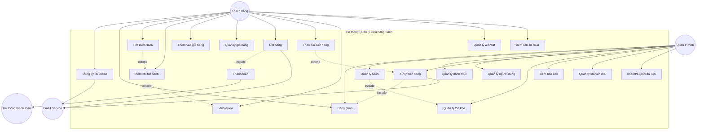
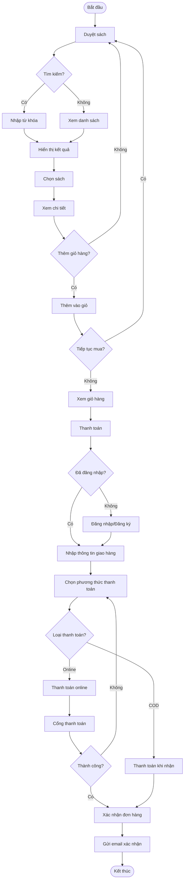

# 📋 PHÂN TÍCH YÊU CẦU HỆ THỐNG QUẢN LÝ CỬA HÀNG SÁCH

## 1. 🎯 CHỨC NĂNG CHÍNH CỦA HỆ THỐNG

### 1.1 Nhóm chức năng cho Khách hàng (Customer)

#### 🔍 **Tìm kiếm & Duyệt sách**
- Tìm kiếm sách theo tên, tác giả, ISBN
- Lọc theo thể loại, giá, năm xuất bản
- Xem danh sách sách theo thể loại
- Xem chi tiết thông tin sách
- Xem sách bán chạy, sách mới

#### 👤 **Quản lý tài khoản**
- Đăng ký tài khoản mới
- Đăng nhập/Đăng xuất
- Xem và cập nhật thông tin cá nhân
- Đổi mật khẩu
- Quản lý địa chỉ giao hàng

#### 🛒 **Giỏ hàng & Đặt hàng**
- Thêm sách vào giỏ hàng
- Cập nhật số lượng trong giỏ
- Xóa sản phẩm khỏi giỏ
- Tiến hành đặt hàng
- Chọn phương thức thanh toán
- Theo dõi trạng thái đơn hàng
- Xem lịch sử mua hàng

#### ⭐ **Đánh giá & Tương tác**
- Viết review cho sách đã mua
- Đánh giá sao (1-5)
- Thêm sách vào wishlist
- Chia sẻ sách lên mạng xã hội
- Xem recommendations dựa trên lịch sử

### 1.2 Nhóm chức năng cho Quản trị viên (Admin)

#### 📚 **Quản lý sách**
- Thêm sách mới vào hệ thống
- Cập nhật thông tin sách
- Xóa/Ẩn sách
- Quản lý tồn kho
- Import sách từ file Excel/CSV
- Quản lý hình ảnh sách

#### 📂 **Quản lý danh mục**
- Tạo, sửa, xóa thể loại sách
- Sắp xếp thứ tự hiển thị
- Quản lý danh mục con

#### 👥 **Quản lý người dùng**
- Xem danh sách khách hàng
- Khóa/Mở khóa tài khoản
- Phân quyền nhân viên
- Xem lịch sử hoạt động người dùng

#### 📦 **Quản lý đơn hàng**
- Xem danh sách đơn hàng
- Cập nhật trạng thái đơn hàng
- Xử lý hoàn trả/hủy đơn
- In hóa đơn
- Quản lý vận chuyển

#### 📊 **Báo cáo & Thống kê**
- Báo cáo doanh thu theo thời gian
- Thống kê sách bán chạy
- Báo cáo tồn kho
- Phân tích khách hàng
- Export báo cáo PDF/Excel

#### 🎫 **Quản lý khuyến mãi**
- Tạo mã giảm giá
- Thiết lập chương trình khuyến mãi
- Quản lý voucher
- Flash sale theo giờ

---

## 2. 📝 USER STORIES

### 👤 **EPIC 1: Quản lý Tài khoản Khách hàng**

**US1.1**: Như một khách hàng mới, tôi muốn đăng ký tài khoản để có thể mua sách và theo dõi đơn hàng.
- **Acceptance Criteria**:
  - Có form đăng ký với email, password, họ tên, SĐT
  - Validate email đúng định dạng
  - Password tối thiểu 8 ký tự
  - Gửi email xác nhận sau đăng ký

**US1.2**: Như một khách hàng, tôi muốn đăng nhập vào hệ thống để truy cập tài khoản của mình.
- **Acceptance Criteria**:
  - Đăng nhập bằng email/password
  - Có option "Remember me"
  - Hiển thị thông báo lỗi rõ ràng
  - Redirect về trang trước đó sau đăng nhập

**US1.3**: Như một khách hàng, tôi muốn reset mật khẩu khi quên để lấy lại quyền truy cập.
- **Acceptance Criteria**:
  - Gửi link reset qua email
  - Link có hiệu lực trong 1 giờ
  - Yêu cầu password mới và confirm

### 🔍 **EPIC 2: Tìm kiếm & Duyệt sách**

**US2.1**: Như một khách hàng, tôi muốn tìm kiếm sách theo từ khóa để nhanh chóng tìm được sách cần mua.
- **Acceptance Criteria**:
  - Search bar ở header
  - Tìm theo tên sách, tác giả, ISBN
  - Auto-suggest khi gõ
  - Hiển thị kết quả với pagination

**US2.2**: Như một khách hàng, tôi muốn lọc sách theo nhiều tiêu chí để thu hẹp kết quả tìm kiếm.
- **Acceptance Criteria**:
  - Lọc theo: thể loại, giá, rating, tác giả
  - Có thể chọn nhiều filter cùng lúc
  - Hiển thị số lượng kết quả
  - Clear all filters option

**US2.3**: Như một khách hàng, tôi muốn xem chi tiết sách để đưa ra quyết định mua hàng.
- **Acceptance Criteria**:
  - Hiển thị: ảnh, tên, tác giả, giá, mô tả
  - Thông tin chi tiết: ISBN, NXB, số trang
  - Reviews & ratings
  - Sách liên quan

### 🛒 **EPIC 3: Giỏ hàng & Đặt hàng**

**US3.1**: Như một khách hàng, tôi muốn thêm sách vào giỏ hàng để mua nhiều sách cùng lúc.
- **Acceptance Criteria**:
  - Nút "Thêm vào giỏ" ở trang chi tiết
  - Quick add từ danh sách sách
  - Hiển thị notification khi thêm thành công
  - Update số lượng trên icon giỏ hàng

**US3.2**: Như một khách hàng, tôi muốn quản lý giỏ hàng để điều chỉnh đơn hàng trước khi thanh toán.
- **Acceptance Criteria**:
  - Xem danh sách sản phẩm trong giỏ
  - Thay đổi số lượng
  - Xóa sản phẩm
  - Hiển thị tổng tiền real-time

**US3.3**: Như một khách hàng, tôi muốn tiến hành đặt hàng để hoàn tất việc mua sách.
- **Acceptance Criteria**:
  - Form nhập thông tin giao hàng
  - Chọn phương thức thanh toán
  - Review đơn hàng trước khi xác nhận
  - Nhận email xác nhận đơn hàng

**US3.4**: Như một khách hàng, tôi muốn theo dõi đơn hàng để biết tình trạng giao hàng.
- **Acceptance Criteria**:
  - Xem danh sách đơn hàng đã đặt
  - Xem chi tiết từng đơn
  - Tracking trạng thái: Chờ xử lý → Đang giao → Hoàn thành
  - Hủy đơn nếu chưa giao

### ⭐ **EPIC 4: Đánh giá & Tương tác**

**US4.1**: Như một khách hàng đã mua sách, tôi muốn viết review để chia sẻ trải nghiệm.
- **Acceptance Criteria**:
  - Chỉ review sách đã mua
  - Đánh giá 1-5 sao
  - Viết nhận xét text
  - Upload ảnh (optional)

**US4.2**: Như một khách hàng, tôi muốn thêm sách vào wishlist để mua sau.
- **Acceptance Criteria**:
  - Icon heart để thêm/xóa wishlist
  - Xem danh sách wishlist
  - Chuyển từ wishlist vào giỏ hàng
  - Nhận thông báo khi sách giảm giá

### 👨‍💼 **EPIC 5: Quản trị Sách (Admin)**

**US5.1**: Như một admin, tôi muốn thêm sách mới để cập nhật catalog.
- **Acceptance Criteria**:
  - Form nhập đầy đủ thông tin sách
  - Upload nhiều ảnh
  - Set giá bán, giá gốc
  - Chọn thể loại, tác giả

**US5.2**: Như một admin, tôi muốn quản lý tồn kho để kiểm soát số lượng.
- **Acceptance Criteria**:
  - Xem số lượng tồn kho
  - Cập nhật khi nhập hàng
  - Cảnh báo sắp hết hàng
  - Báo cáo tồn kho

**US5.3**: Như một admin, tôi muốn import sách hàng loạt để tiết kiệm thời gian.
- **Acceptance Criteria**:
  - Upload file Excel/CSV
  - Preview trước khi import
  - Validate dữ liệu
  - Report lỗi chi tiết

### 📦 **EPIC 6: Quản lý Đơn hàng (Admin)**

**US6.1**: Như một admin, tôi muốn xem và xử lý đơn hàng để đảm bảo giao hàng kịp thời.
- **Acceptance Criteria**:
  - Dashboard hiển thị đơn mới
  - Filter theo trạng thái
  - Cập nhật trạng thái đơn
  - Ghi chú nội bộ

**US6.2**: Như một admin, tôi muốn xử lý hoàn trả để giải quyết khiếu nại.
- **Acceptance Criteria**:
  - Nhận yêu cầu hoàn trả
  - Approve/Reject với lý do
  - Cập nhật tồn kho khi hoàn trả
  - Refund tiền cho khách

### 📊 **EPIC 7: Báo cáo & Thống kê (Admin)**

**US7.1**: Như một admin, tôi muốn xem báo cáo doanh thu để đánh giá hiệu quả kinh doanh.
- **Acceptance Criteria**:
  - Báo cáo theo ngày/tuần/tháng/năm
  - Biểu đồ trực quan
  - So sánh với kỳ trước
  - Export PDF/Excel

**US7.2**: Như một admin, tôi muốn phân tích sách bán chạy để điều chỉnh chiến lược.
- **Acceptance Criteria**:
  - Top 10 sách bán chạy
  - Phân tích theo thể loại
  - Trend theo thời gian
  - Sách tồn kho lâu

---

## 3. 🎨 USE CASE DIAGRAM



## 4. 📊 CHI TIẾT USE CASES CHÍNH

### UC-001: Đăng ký tài khoản
**Actor**: Khách hàng  
**Mô tả**: Khách hàng tạo tài khoản mới trong hệ thống  
**Tiền điều kiện**: Chưa có tài khoản  
**Luồng chính**:
1. Khách hàng nhấn "Đăng ký"
2. Hệ thống hiển thị form đăng ký
3. Khách hàng nhập thông tin (email, password, họ tên, SĐT)
4. Hệ thống validate thông tin
5. Hệ thống tạo tài khoản và gửi email xác nhận
6. Khách hàng xác nhận qua email

**Luồng thay thế**:
- 4a. Email đã tồn tại → Thông báo lỗi
- 4b. Password yếu → Yêu cầu nhập lại

### UC-003: Tìm kiếm sách
**Actor**: Khách hàng  
**Mô tả**: Tìm kiếm sách theo các tiêu chí  
**Tiền điều kiện**: Không  
**Luồng chính**:
1. Khách hàng nhập từ khóa vào search box
2. Hệ thống hiển thị gợi ý (auto-complete)
3. Khách hàng submit tìm kiếm
4. Hệ thống hiển thị kết quả
5. Khách hàng có thể áp dụng filters
6. Hệ thống cập nhật kết quả

**Luồng thay thế**:
- 4a. Không tìm thấy → Hiển thị "Không có kết quả" + gợi ý

### UC-007: Đặt hàng
**Actor**: Khách hàng  
**Mô tả**: Hoàn tất quy trình mua hàng  
**Tiền điều kiện**: Đã đăng nhập, có sản phẩm trong giỏ  
**Luồng chính**:
1. Khách hàng nhấn "Thanh toán" từ giỏ hàng
2. Hệ thống hiển thị form thông tin giao hàng
3. Khách hàng nhập/chọn địa chỉ giao hàng
4. Hệ thống hiển thị phương thức thanh toán
5. Khách hàng chọn phương thức thanh toán
6. Hệ thống hiển thị tổng quan đơn hàng
7. Khách hàng xác nhận đặt hàng
8. Hệ thống tạo đơn hàng và gửi email xác nhận

**Luồng thay thế**:
- 5a. Thanh toán online → Chuyển đến cổng thanh toán
- 7a. Hủy đặt hàng → Quay lại giỏ hàng

### UC-020: Quản lý sách (Admin)
**Actor**: Admin  
**Mô tả**: Thêm, sửa, xóa sách trong hệ thống  
**Tiền điều kiện**: Đã đăng nhập với quyền admin  
**Luồng chính**:
1. Admin vào trang quản lý sách
2. Hệ thống hiển thị danh sách sách
3. Admin chọn hành động (Thêm/Sửa/Xóa)
4. Nếu Thêm: Nhập thông tin sách mới
5. Nếu Sửa: Cập nhật thông tin
6. Nếu Xóa: Xác nhận xóa
7. Hệ thống lưu thay đổi

**Luồng thay thế**:
- 4a. Validate lỗi → Hiển thị lỗi cụ thể
- 6a. Sách đang có trong đơn hàng → Không cho xóa, chỉ ẩn

## 5. 🔄 ACTIVITY DIAGRAM - QUY TRÌNH ĐẶT HÀNG



## 6. 🏗️ KIẾN TRÚC HỆ THỐNG

### Kiến trúc 3-Layer:

```
┌─────────────────────────────────────────┐
│         Presentation Layer              │
│   (React.js - Frontend Application)     │
├─────────────────────────────────────────┤
│          Business Logic Layer           │
│      (Express.js - REST API)           │
├─────────────────────────────────────────┤
│           Data Access Layer             │
│    (MongoDB/MySQL - Database)           │
└─────────────────────────────────────────┘
```

### API Endpoints chính:

**Authentication**:
- POST /api/auth/register
- POST /api/auth/login
- POST /api/auth/logout
- POST /api/auth/forgot-password

**Books**:
- GET /api/books (list, search, filter)
- GET /api/books/:id
- POST /api/books (admin)
- PUT /api/books/:id (admin)
- DELETE /api/books/:id (admin)

**Orders**:
- POST /api/orders
- GET /api/orders/user/:userId
- GET /api/orders/:id
- PUT /api/orders/:id/status (admin)

**Cart**:
- GET /api/cart
- POST /api/cart/add
- PUT /api/cart/update
- DELETE /api/cart/remove/:itemId

## 7. 📱 RESPONSIVE DESIGN REQUIREMENTS

- **Mobile** (320px - 768px): Single column, touch-optimized
- **Tablet** (768px - 1024px): 2 columns, larger touch targets
- **Desktop** (1024px+): Full layout, hover effects

## 8. 🔒 SECURITY REQUIREMENTS

- JWT authentication với refresh tokens
- Password hashing với bcrypt
- Input validation & sanitization
- Rate limiting cho APIs
- HTTPS enforcement
- XSS & CSRF protection
- SQL injection prevention
- Role-based access control (RBAC)